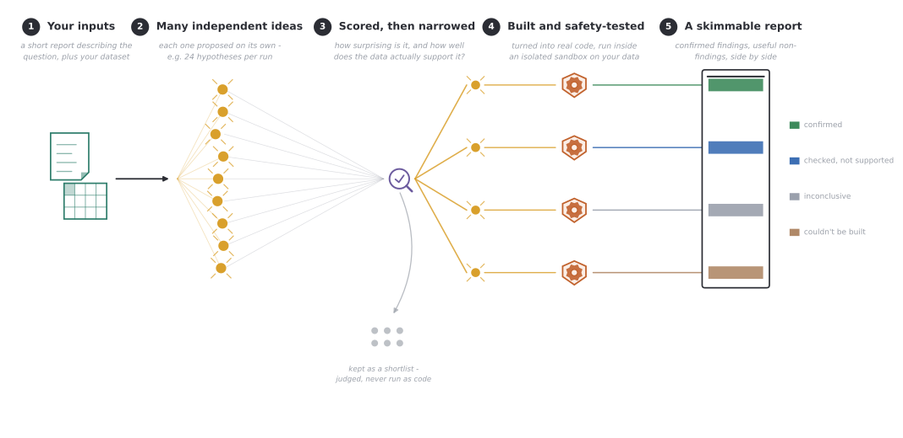

# Data Prospector

[](https://www.gnu.org/licenses/gpl-3.0)
[](https://www.python.org/downloads/)
[](https://www.anthropic.com)
[](https://www.docker.com)

Data Prospector explores a dataset from **many independent angles at once**, using AI - instead of
converging on one "best" analysis, the way most automated analysis tools do. You give it a short
description of your question and your data; it comes back with a shortlist of the most
interesting, best-supported ideas it found, each one backed by real code that was actually run
against your data. Crucially, that shortlist includes ideas that turned out to be **wrong** -
tested and found unsupported, not swept away - because knowing what *isn't* true is often just as
useful as knowing what is.

No single step here needs you to write or read Python - running an analysis is copy-pasting one
command into a terminal. Understanding the *design* of the pipeline (further down this file) does
get more technical, and adapting it to a brand-new dataset needs someone comfortable editing
Python - but using it on the example data, or your own data once someone has configured it for
you, doesn't.

<p align="center">
  
</p>

> [!WARNING]
>## Before you start: this isn't an oracle
>
>Read this before running anything on your own data - it will save you a disappointing first run.
>
>This tool doesn't discover truth on its own. It's only ever as good as two things you provide: how clearly your report states what you actually want to know, and how clean and well-organised your data is. A vague report paired with messy, disorganised, or inconsistent data is unlikely to produce anything useful - not because the tool failed, but because there wasn't enough real signal in the input for it to work with. The clearer and more specific your question, and the more consistent your data, the better a shot it has.
>
>It's also a genuinely new, actively-developed research tool, not a finished, hardened product. Building it has surfaced a long list of real bugs and limitations along the way, and the large majority of them trace back to the same root cause: an assumption - made by the AI, not by you - about the input data or the report that turned out to be wrong (a response value the report never mentioned, a column that didn't mean what it looked like it meant, a software library that had quietly changed its behaviour). Every one of these is recorded, in detail, in [`DIVERGER_PLAN.md`](DIVERGER_PLAN.md), and fixing them has made the pipeline noticeably more reliable over time - but assume more are still out there on data and questions it hasn't seen before. **Always read the generated code and treat every finding, confirmed or not, as a lead to check yourself - not a conclusion to take on trust.**

## Design influences

The architecture started from two Anthropic sources: *Building effective agents* [1] (the
orchestrator-worker and evaluator-optimizer patterns behind the code-building step) and the
`claude-cookbooks` tutorials [2]. The fan-out → judge → selectively-build shape was later informed
by two published multi-agent science systems [3, 4]. See `DIVERGER_PLAN.md` §1 for how this project
grew out of an earlier "converger" design that worked the opposite way.

1. Schluntz, E., & Zhang, B. (2024, December 19). *Building effective agents*. Anthropic.
   https://www.anthropic.com/engineering/building-effective-agents
2. Anthropic. (n.d.). *claude-cookbooks* [Source code]. GitHub.
   https://github.com/anthropics/claude-cookbooks
3. Gottweis, J., Weng, W.-H., Daryin, A., et al. (2026). Accelerating scientific discovery with
   Co-Scientist. *Nature*, *655*(8122), 487–496. https://doi.org/10.1038/s41586-026-10644-y
4. Lu, C., Lu, C., Lange, R. T., Yamada, Y., Hu, S., Foerster, J., Ha, D., & Clune, J. (2026). Towards
   end-to-end automation of AI research *(known informally as "The AI Scientist")*. *Nature*, *651*,
   914–919. https://doi.org/10.1038/s41586-026-10265-5

## Why "diverge" instead of "converge"?

Most automated-analysis tools work like a single very persistent analyst: try something, look at
the result, refine it, try again, and hand you one final, polished script. That process is good at
producing something that *works* - but it tends to settle on the same conventional, unsurprising
analysis a competent analyst would reach for first, because "keep refining the same idea" is
exactly the process that rewards convention.

Data Prospector does the opposite. It asks many independent "reasoners" to each propose a *different*
idea about your data - deliberately never letting them see or build on each other's proposals mid-thought
- then has two independent reviewers score every idea for how surprising it is and how well the
data actually seems to support it, and only *then* picks the strongest handful to actually build
and test. The result isn't one script - it's a spread of leads, ranked and explained, for you to
read and judge for yourself. See [`DIVERGER_PLAN.md`](DIVERGER_PLAN.md) §1 for the fuller
rationale, including the earlier "converger" design this project grew out of.

## How it works

1. **Your inputs.** A short written report describing your research question (what you want to
   find out, and anything you already know or want to rule out), plus your actual dataset - CSVs,
   text files, whatever shape your data is in.
2. **Many independent ideas.** The AI proposes a batch of candidate hypotheses about your data -
   by default, 24 per run (`2` rounds × `12` per round) - each one generated on its own, without
   seeing what the others came up with, so they genuinely differ rather than being variations on
   one theme.
3. **Scored, then narrowed.** Every idea is independently rated on two separate questions: *is
   this actually a surprising, non-obvious angle*, and *does the data plausibly support it at
   all*? Only the highest-scoring handful (`4` by default) go on to the next step - the rest are
   kept as a written shortlist, with the reviewers' reasoning attached, but never turned into code.
4. **Built and safety-tested.** Each selected idea is turned into real, runnable Python code and
   executed inside a locked-down sandbox (via [Docker](https://www.docker.com)) - no internet
   access, limited memory, and no ability to touch anything outside that one test run - against
   your actual data. If it fails, it gets a few automatic attempts to fix itself before being
   reported as unable to run.
5. **A skimmable report.** Everything lands in one markdown file: confirmed findings and
   *disconfirmed* findings shown side by side (a clean "no" is treated as a real result, not
   hidden), plus anything that couldn't be completed and why. You open it in any text editor, or a
   markdown viewer/previewer, and read it top to bottom in a few minutes.

There is deliberately no automatic "quality" score standing between you and the ideas it
generates - the AI's own numeric self-ratings turned out, across many runs, to be a poor guide to
what's actually worth reading (see `DIVERGER_PLAN.md` §15, class E). The *written reasoning* behind
each idea's score is far more trustworthy than any single number would be, so that's what's shown.

## What you'll actually get

The report groups every idea it fully tested into one of a few outcomes. These are the exact words
you'll see in the generated report (`realised`, etc. is the internal name, shown in brackets so it
matches what you'll find if you go looking in the underlying files):

| In the report                                   | What it means                                                                                                                                                                    |
|-------------------------------------------------|----------------------------------------------------------------------------------------------------------------------------------------------------------------------------------|
| ✅ **Confirmed** (`realised`)                    | Fully tested against your real data, and the pattern the idea predicted was actually there.                                                                                      |
| 🔁 **Checked, not supported** (`realised_null`) | Fully tested - and the data does **not** support it. Still a real result: it tells you what's *not* worth chasing.                                                               |
| ⚠️ **Inconclusive** (`pattern_not_shown`)       | The code ran, but its output (e.g. a chart) wasn't clear enough to say either way. A genuine limitation of that attempt, not a finding.                                          |
| 🚧 **Couldn't be built** (`not_realisable`)     | Needed something not set up in this environment (e.g. a missing piece of software) and never got the chance to actually run.                                                     |
| ⚙️ **Technical hiccup** (`realization_error`)   | Something in the pipeline itself broke while working on this one idea - unrelated to your data or the idea's merit.                                                              |
| ❌ **Not pursued** (`unsupportable`)             | Judged, on paper, as unlikely to be answerable well with this data, so it was never turned into code at all - still listed, with the reviewer's reasoning, in case you disagree. |

Confirmed and disconfirmed results are shown together, ranked by how *surprising* they are - not
by whether they turned out to be "yes" or "no" - because on real datasets the most interesting
result is often a confirmed surprise sitting right next to an equally-surprising thing that turned
out not to hold up.

Alongside the report, you also get: every compiled script that produced a result (so you, or a
collaborator with more coding experience, can check exactly what was run), any charts/plots it
produced, and a second file listing *every* idea that was generated and scored this run - not just
the handful that got built - in case something further down the ranking still looks worth a second
look.

## Getting set up

You'll need three things before your first run. None of this needs Python knowledge - it's
installing a couple of standard applications and pasting a few commands into a terminal.

**1. [pixi](https://pixi.sh)**, which installs the exact Python version and packages this project
needs for you - you don't manage any of that by hand. [Install pixi](https://pixi.sh/latest/#installation),
then, from inside this folder:

```bash
pixi install
```

**2. [Docker Desktop](https://www.docker.com/products/docker-desktop/)**, running in the
background. This is what actually runs the AI-generated code - inside an isolated, locked-down
mini-environment with no internet access and no way to touch anything outside that one test, so
nothing it does can affect your real computer or files. Install it, start it, then build the image
this project uses (a one-off step, and again any time the project's `Dockerfile` changes):

```bash
docker build --target cbias-analysis -t cbias-analysis:latest .
```

**3. An Anthropic API key.** This is what lets the pipeline talk to Claude. Get one at
[console.anthropic.com](https://console.anthropic.com), then create a plain text file named
`.env` in this folder containing:

```
ANTHROPIC_API_KEY=sk-ant-...
```

(this file is already excluded from version control, so your key won't accidentally get shared).
The bundled example config additionally routes some of its mechanical, high-volume calls to
DeepSeek for cost reasons (get a key at [platform.deepseek.com](https://platform.deepseek.com)) -
add two more lines to the same `.env` file:

```
DEEPSEEK_API_KEY=...
DEEPSEEK_BASE_URL=https://api.deepseek.com/anthropic
```

> **A note on cost.** Every run makes real calls to Claude (and, for the bundled example,
> DeepSeek) - typically several dozen to a little over a hundred, depending on the settings below.
> That has a genuine, if modest, cost billed to whichever account the API key belongs to. If
> you're just getting a feel for the tool, consider starting with a smaller `--angles-per-iteration`
> (see Flags below) before running it at full scale.

## Running your first analysis

A worked example - a real academic symposium's registration data, feedback surveys, and
programme - already ships with this repository, so this runs immediately with no setup beyond the
above:

```bash
pixi run python app.py --config cbias
```

This takes a while (the pipeline is doing dozens of AI calls and running several pieces of
generated code) - expect somewhere from several minutes to a while longer, depending on the
settings. When it finishes, it prints exactly where everything was written; the report itself
lands at `outputs/gallery_<timestamp>.md`.

### Flags

You won't need most of these on a first run - they're here for once you're comfortable and want
more or fewer ideas explored.

```
--config {bioimage,trello,cbias}   Which example/domain to run (default: cbias - the only one
                                    with sample data and a ready-to-use setup in this repository)
--report PATH                      Your own report file, if not using the bundled example
--data-dir PATH                    Your own data folder, if not using the bundled example
--output-dir PATH                  Where to write the report (default: ./outputs)
--max-iterations N                 How many rounds of idea generation to run (default: 2)
--angles-per-iteration N           How many ideas to generate per round (default: 12)
--realize-top-k N                  How many of the top-ranked ideas actually get built and tested
                                    as real code (default: 4) - the rest stay as a written
                                    shortlist only
--skip-preflight                   Skip the startup check that Docker and the AI services are
                                    reachable before committing to a full run. Leave this on
                                    unless you're deliberately testing without Docker running.
```

At the defaults, that's `2 × 12 = 24` candidate ideas generated and scored, with the top `4`
actually built and tested - see `DIVERGER_PLAN.md` §12.4 for the full cost breakdown if you want to
plan around it.

## Using this on your own data

This currently ships with one fully worked example (CBIAS, above) and one further domain
(`trello`) that has run successfully once but is still early days - see the table below. Pointing
this at a genuinely new dataset and question is possible, but it's a task for whoever on your team
is comfortable editing Python and reading a bit of existing example code, not a config file you
fill in - expect to sit down with a collaborator for this part if that's not you.

<details>
<summary><strong>What "adapting it" actually involves</strong> (click to expand)</summary>

The pipeline itself never changes between domains - only a small Python file describing the new
domain does. Concretely, that file needs to:

- Say which AI model handles which role (there are six roles, from cheap/fast ones for mechanical
  work to a higher-quality one for judging ideas and safety-checking output)
- List which Python libraries the generated code is allowed to use, and point at a
  [Docker](https://www.docker.com) image that already has them installed
- Describe the shape of the data (file layout, column names, known quirks) so the AI isn't
  guessing
- Provide a small function that scans the actual data folder and summarises what's really there

`cbias_config.py` is a complete, working example to copy from. The full technical checklist is in
[`CLAUDE.md`](CLAUDE.md) under "Adding a new domain."

| Example              | Status                                                                                                                                                                                                                                   |
|----------------------|------------------------------------------------------------------------------------------------------------------------------------------------------------------------------------------------------------------------------------------|
| `cbias_config.py`    | The proven one. Every tuned setting in this project's design log is based on this example. Sample data ships in this repo, ready to run out of the box.                                                                                  |
| `trello_config.py`   | Has completed one full, successful run on a different kind of dataset (a Trello project-management board export) - real evidence the pipeline generalises, but still just one run's worth of confidence. Sample data ships in this repo. |
| `bioimage_config.py` | A template only - nobody has actually pointed it at real data yet. Pass `--config bioimage` only if you're supplying your own report and data.                                                                                           |

</details>

## A few practical notes

- Generated code can only use the software libraries each example explicitly allows - see
  `AVAILABLE_LIBRARIES` near the top of the relevant `*_config.py` file if you're curious exactly
  what's available for the bundled CBIAS example.
- By default, the pipeline checks that Docker and the AI services it needs are actually reachable
  *before* doing any real work, and stops with a clear message if something's wrong - rather than
  running for several minutes and discovering the problem only at the end. If you deliberately skip
  that check (`--skip-preflight`) and Docker turns out to be unavailable partway through, ideas are
  still generated and scored as normal, but nothing gets built or tested as real code - every idea
  that would have been tested is reported honestly as "couldn't be built," never silently marked as
  a pass.
- There's no automated check for whether an idea is a *good* one - that's deliberate. The only
  automatic check is whether generated code actually runs correctly; judging whether a finding is
  worth pursuing is left to you, the reader.
- [`DIVERGER_PLAN.md`](DIVERGER_PLAN.md) is this project's running design and decision log - every
  tuning choice and known limitation is written up there, in detail, if you want to understand *why*
  something works the way it does.

## License

GPL-3.0 - See [LICENSE](LICENSE) for details.
